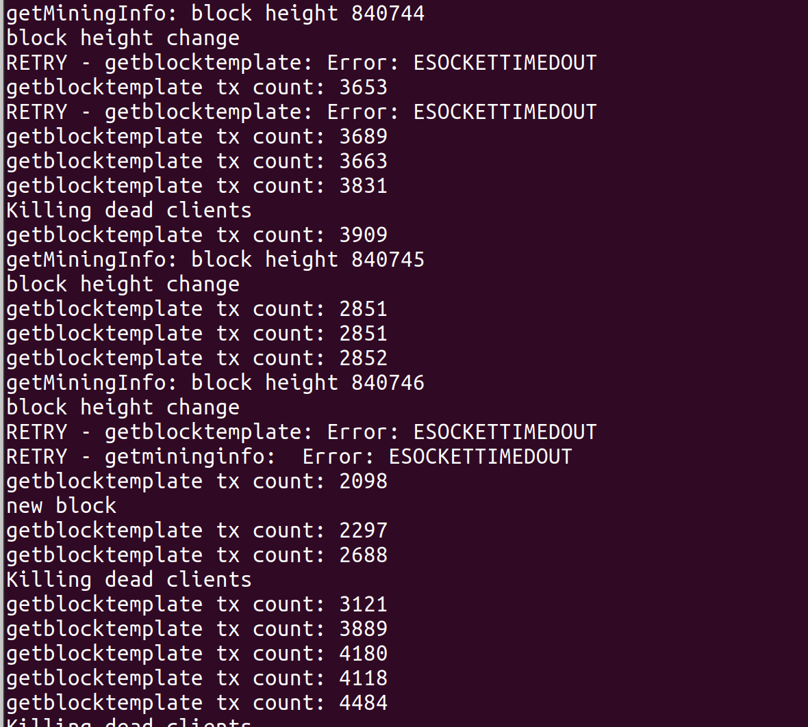
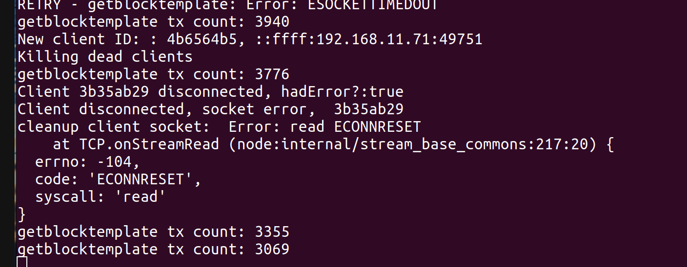

## Description

A Nestjs and Typescript Bitcoin stratum mining server.

PR describes modifications to handle socket connections and new logging.






## Installation

```bash
$ npm install
```

create an new .env file in the root directory and configure it with the parameters in .env.example

## Running the app

```bash
# development
$ npm run start

# watch mode
$ npm run start:dev

# production build
$ npm run build
```

## Test

```bash
# unit tests
$ npm run test

# test coverage
$ npm run test:cov
```

## Web interface

See [public-pool-ui](https://github.com/benjamin-wilson/public-pool-ui)

## Deployment

Install pm2 (https://pm2.keymetrics.io/)

```bash
$ pm2 start dist/main.js
```

## Docker

Build container:

```bash
$ docker build -t public-pool .
```

Run container:

```bash
$ docker container run --name public-pool --rm -p 3333:3333 -p 3334:3334 -p 8332:8332 -v .env:/public-pool/.env public-pool
```

### Docker Compose

Build container:
```bash
$ docker compose build
```

Run container:
```bash
$ docker compose up -d
```
Build and run container:

```bash
$ docker-compose up --build -d
```

The docker-compose binds to `127.0.0.1` by default. To expose the Stratum services on your server change:
```diff
    ports:
-      - "127.0.0.1:3333:3333/tcp"
-      - "127.0.0.1:3334:3334/tcp"
+      - "3333"
+      - "3334"
```

**note**: To successfully connect to the bitcoin RPC you will need to add

```
rpcallowip=172.16.0.0/12
```

to your bitcoin.conf.

Terminal Logs:
```bash
docker logs -f public-pool
```
